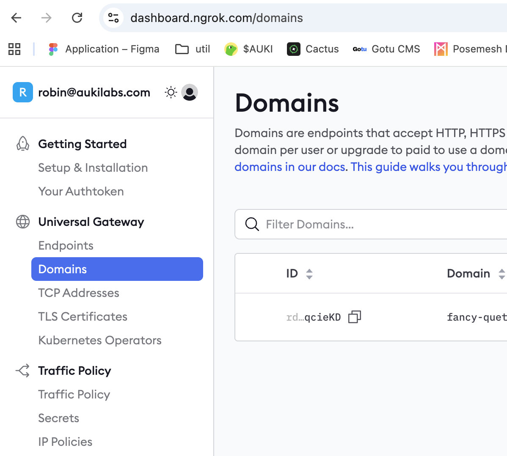

# Deployment

The Reconstruction compute node (Rust) is available on [Docker Hub](https://hub.docker.com/r/aukilabs/reconstruction-node). Both deployment options are Docker-based and still run the same Python reconstruction pipeline under the hood.

## Initial Setup

1. First check that your NVIDIA driver and CUDA toolkit meet the requirements in the [Minimum Requirements](minimum-requirements.md) and update as needed:
   ```shell
   nvidia-smi
   ```
   This should output information about your GPU. If not, please double check that your installed CUDA and driver versions are correct, and restart your computer.

2. If you have a static IP, allow inbound TCP traffic to port 8080. Optionally also configure a domain name for it.

   Or, if your IP is not static, you need to set up Dynamic DNS pointing to your IP.

   One easy alternative if you don't have a static IP is to use ngrok:
   <details>
   <summary><strong>Ngrok Setup (optional)</strong></summary>

   1. **Install ngrok**  
      Follow [this beginner's tutorial 🔗](https://medium.com/@thexpertdev/ngrok-tutorial-for-beginners-how-to-expose-localhost-to-the-internet-and-test-webhooks-70845654fced) to install ngrok on your system.

   2. **Create a static domain**  
      On the ngrok website, set up a static domain as shown below:  
      

   3. **Expose your server**  
      Run the following command (replace with your own ngrok domain):
      ```shell
      ngrok http --url my-cool-address.ngrok-free.app 8080
      ```
      Then set `NODE_URL` in your `.env` to the HTTPS ngrok URL.

   <br/>

   💡 **NOTE:** If you restart your computer or server, you must ensure ngrok is running again, or your server will not be reachable.

   </details>

3. Disable power-saving settings like automatic sleep or standby mode, to keep your computer on and able to receive jobs.

4. Make sure the node is reachable from the public internet on port 8080. The compute node exposes:
   - `GET /health` (liveness)
   - `POST /internal/v1/registrations` (DDS registration callback)

## Prepare credentials + env file

Before you run the container, create a `.env` file with the required credentials:
```shell
NODE_URL=https://your-public-url
REG_SECRET=your-registration-secret
SECP256K1_PRIVHEX=your-evm-private-key
```
Optional overrides (defaults shown):
```shell
DMS_BASE_URL=https://dms.auki.network/v1
DDS_BASE_URL=https://dds.auki.network
REQUEST_TIMEOUT_SECS=60
REGISTER_INTERVAL_SECS=120
REGISTER_MAX_RETRY=-1
LOG_FORMAT=text
```

Notes:
- `REG_SECRET` comes from registering a **compute node** in the Posemesh Console.
- `SECP256K1_PRIVHEX` is the hex-encoded private key of the **staked** EVM wallet for that node.
- `NODE_URL` must be publicly reachable (include scheme + port, e.g. `https://example.com:8080`).
- Optional runner tuning:
  - `LOCAL_RUNNER_CPU_WORKERS` (default `2`)
  - `GLOBAL_RUNNER_CPU_WORKERS` (default `2`)

How to get the registration secret + wallet key:
1. Log in to the Posemesh Console at `https://console.auki.network/`.
2. Open the **Manage Nodes** page and create a node (choose the appropriate operation mode).
3. Copy the registration credentials shown — you will use these as `REG_SECRET`.
4. Go to **Staking**, connect your wallet, and stake the required amount of $AUKI for that node.
5. Export the wallet private key (hex) and set it as `SECP256K1_PRIVHEX`.

## Option 1 — Use the prebuilt image (recommended)

Pull the latest stable docker image. If you are upgrading from a previous version you must **run this again** to pull the updated image.
```shell
docker pull aukilabs/reconstruction-node:stable
```

Start Docker using the below command, ❗**including all flags**❗
```shell
docker run \
  --gpus all \
  --shm-size 512m \
  -p 8080:8080 \
  --env-file .env \
  --name reconstruction-node \
  -d \
  aukilabs/reconstruction-node:stable
```
You can also pin a specific release tag, for example `aukilabs/reconstruction-node:vX.Y.Z`.

### Verification ✅

1. After deploying, please ensure the server started correctly by running
   ```shell
   docker ps
   ```
   This should show your newly started docker container, with the STATUS showing `Up 45 seconds` or similar.
   Copy the container ID of your server, then run:
   ```shell
   docker logs <container_id>
   ```
   You should see logs indicating the HTTP server is listening and the node is registering with DDS.

2. Ensure your GPU and CUDA works correctly (using the container ID from above):
   ```shell
   docker exec <container_id> nvidia-smi
   ```
   This should show your GPU and driver information.

   Verify that torch detects your GPU:
   ```shell
   docker exec <container_id> python3 -c "import torch; print(torch.cuda.get_device_name(0) if torch.cuda.is_available() else 'CUDA not found')"
   ```
   
   If not, please double-check your setup, or see **Troubleshooting**.

3. Make sure the server is reachable on a public IP or URL.
   Open your browser and navigate to your URL + `/health`,
   e.g. `https://my_amazing_node.ngrok.com/health` or `http://162.88.88.88:8080/health` \
   This should return a 200 response.


## Option 2 — Build Docker image from source

### Building Docker

> **NOTE:** On Mac with Apple Silicon, the --platform flag is needed. Although running the image with CUDA won't work on Mac, the image can still run on a cloud server for example, pulling from the docker hub.

```bash
# Linux computer or deploy to Linux server
docker buildx build --platform linux/amd64 -t {/your/docker/repo}:latest --load -f docker/Dockerfile .

# Jetson Device
DOCKER_BUILDKIT=1 docker buildx build --push --platform linux/arm64 -t {/your/docker/repo}:latest -f docker/Dockerfile.jetson .
```

Run the image as described in Option 1, and follow the same verification steps.

## Troubleshooting ⚠️

Here are some common issues you may encounter, with suggested fixes:

### GPU not detected
- **Symptom:** Server starts but jobs fail, GPU not utilised, or `CUDA not found`.
- **Fixes:**  
  - Ensure you started Docker with `--gpus all`.
  - Check your driver and CUDA toolkit versions against [Minimum Requirements](minimum-requirements.md).
  - Run `nvidia-smi` on host to confirm your GPU is visible.
  - Run `nvcc --version` to confirm your CUDA toolkit is installed, and with the correct version.
  - Restart your computer and try again.

### Corrupted model cache
- **Symptom:** Large model file (e.g. “Eigenplaces”) download fails or jobs fail during image matching.
- **Fix:**
  - Open a terminal into your docker container:
    ```shell
    docker exec -it <container_id> bash
    ```
    Then remove any corrupted files under `~/.cache/torch/hub/checkpoints/`. It will re-download automatically next time a job runs.
  - To avoid repeated downloads, you can also mount the cache directory onto the host using the `-v` flag on your `docker run` command.
    For details about mounting volumes, please consult the official Docker documentation.

### Container killed or crashes under load
- **Symptom:** Server stops or computer restarts during job processing
- **Fix:**  
  - Monitor system RAM and temperatures, and check for overheating or insufficient resources.  
  - Try lowering `LOCAL_RUNNER_CPU_WORKERS` / `GLOBAL_RUNNER_CPU_WORKERS` in your `.env`.

### “out of shm” error
- **Symptom:** Job fails with “out of shared memory.”  
- **Fix:**  
  - Ensure you run Docker with `--shm-size 512m` (already included in the example command).  

### ngrok URL not working, or changes every time you start it
- **Symptom:** Public jobs don’t reach your server when using ngrok.  
- **Fix:**  
  - Use `--url` with a **static ngrok domain** (set up via the ngrok dashboard).  
  - Ensure ngrok is always running; if your server restarts, you might need to also start ngrok again.

### Docker crashes on Windows
- **Symptom:** Container stops after a few minutes on Windows.
- **Fix:**  
  - Restart Docker Desktop.
  - If the issue persists, also restart your computer.

---

💡 **Still stuck?**  
If your issue remains, please:  
1. Check `docker logs <container_id>` for error messages.
2. Share logs and system specs with the [Auki Labs](https://www.aukilabs.com) team for support.
