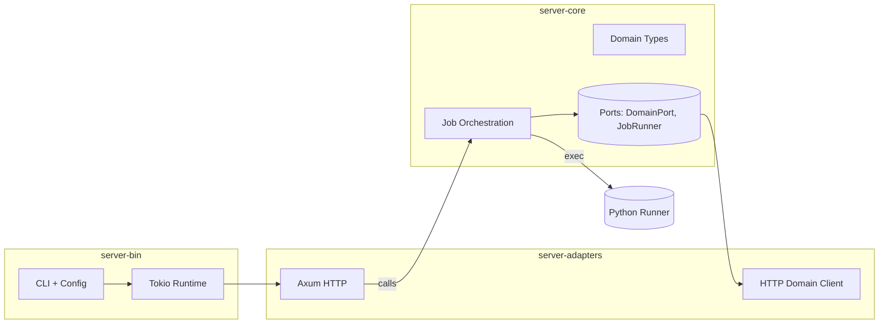

# Rust implementation of reconstruction-server

This Rust workspace rewrites the `server/go/` Go HTTP service into a Rust implementation. It keeps API: `POST /jobs` creates and runs a single concurrent job; `GET /jobs` lists job metadata and statuses; a single‑job offline mode processes `--job-request` and exits.

## Archiecture Diagram

- Workspace crates: `server-core`, `server-adapters`, `server-bin`.
- HTTP endpoints: `POST /jobs`, `GET /jobs`.

## Commands

Build

- `make build`, or
- `cargo build --workspace`

Lint

- `make clippy`, or
- `cargo clippy --all-targets --all-features -- -D warnings`

Format

- `make fmt`, or
- `cargo fmt --all`

Run

- `make run` or
- `cargo run -p server-bin --bin server-bin -- --api-key secret --port :8080`
- Single job: `cargo run -p server-bin --bin server-bin -- --job-request path/to/request.json --retrigger`

Lightweight mock mode (skip Python)

- Set `MOCK_PYTHON=true` (or pass `--mock-python`) to bypass invoking the heavy Python pipeline. Useful for exercising HTTP paths and orchestration without computation.
- Example: `MOCK_PYTHON=true cargo run -p server-bin --bin server-bin -- --api-key secret --port :8080`

Test

- `make test`, or
- `cargo test --workspace`
